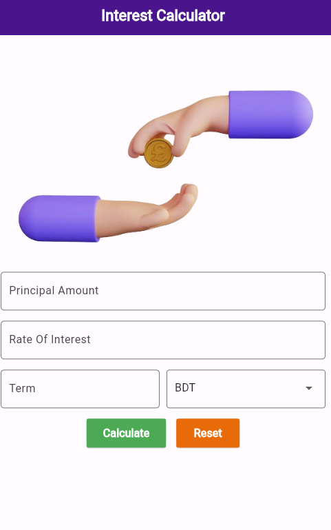
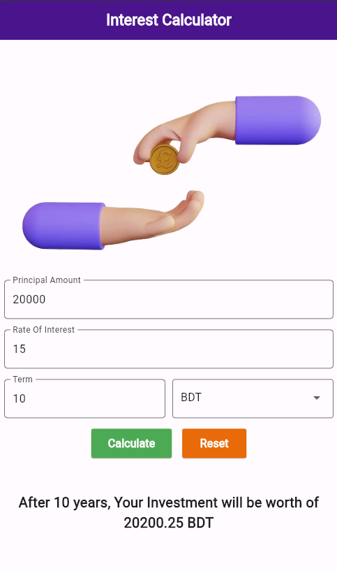

# Interest Calculator

<h4>Build With Flutter</h4>

<h1>App Preview</h1>

<table style="width:100%">
  <tr>
    <th>Home Screen</th>
    <th>Calculation</th>
  </tr>
  <tr>
    <td></td>
    <td></td>
  </tr>
</table>

<h4>Thank you for visiting</h4>
